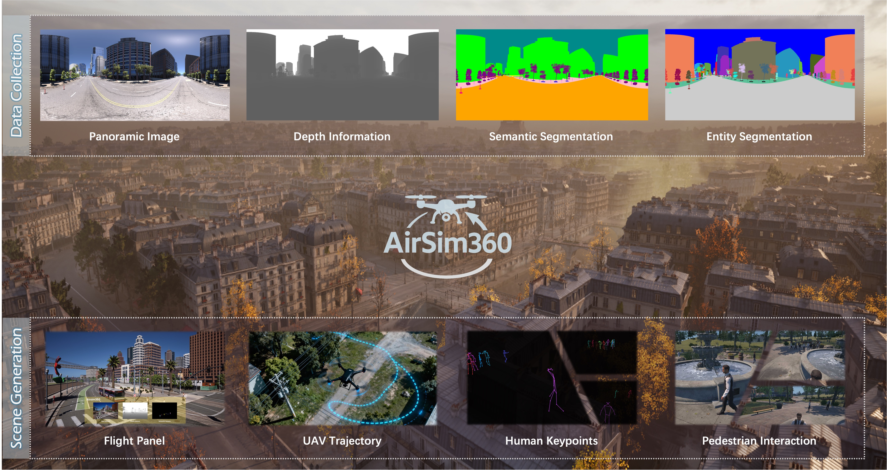
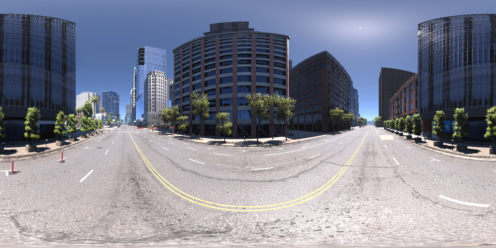
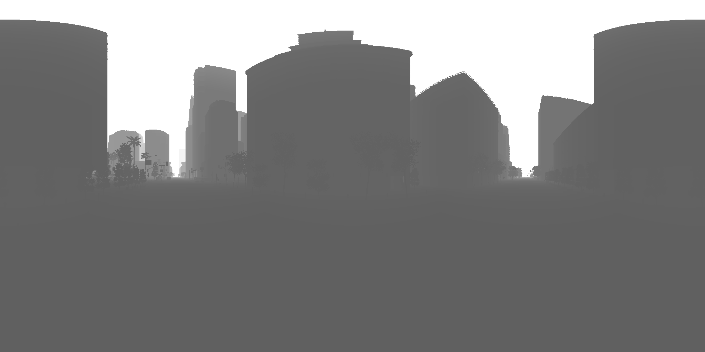
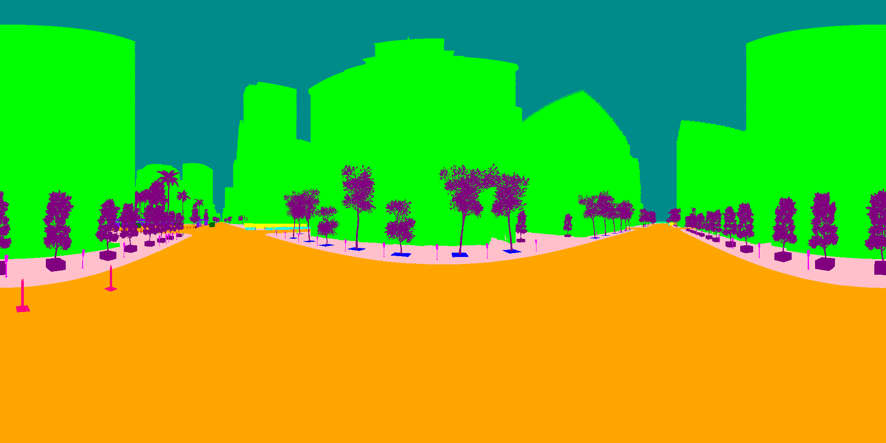
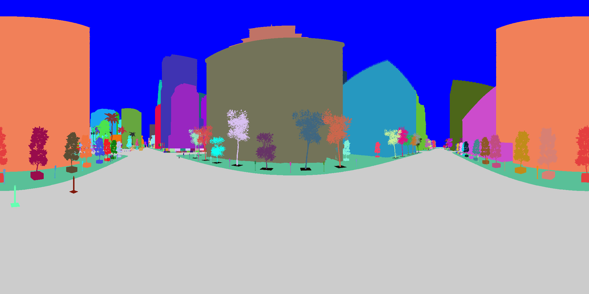

<div align="center">

# 🚁 AirSim360: A Panoramic Simulation Platform within Drone View

[](YOUR_ARXIV_LINK)
[](https://arxiv.org/pdf/2512.02009)
[](https://insta360-research-team.github.io/AirSim360-website/)

*AirSim360 is a high-fidelity **omnidirectional (360°) aerial simulation** stack built on Unreal Engine 5.*

</div>

---

<div align="center">



</div>

---

## 📖 Introduction

**AirSim360** targets the gap in **large-scale, diverse ERP (equirectangular) drone data** and supports **closed-loop** flight with **render-aligned** multimodal exports. This repository distributes **software bundles**, **documentation**, a **synchronized demo frame**, and **media** for the open release.

<details open>
<summary><b>📑 Table of Contents (Click to expand)</b></summary>

- [🗓️ Release Timeline (Roadmap)](#️-release-timeline-roadmap)
- [⚖️ AirSim360 Air vs. Pro](#️-airsim360-air-vs-pro-at-a-glance)
- [📦 Open-source assets](#-open-source-assets-in-this-repository)
- [📂 Repository Layout](#-repository-layout-quick)
- [⚡ Core Simulation Capabilities](#-core-simulation-capabilities-summary)
- [🌍 Omni360-X Dataset Collection](#-omni360-x-dataset-collection)
- [🤝 Acknowledgement](#-acknowledgement)
- [📝 Citation](#-citation)
</details>

---

## 🗓️ Release Timeline (Roadmap)

> ❤️ **A Note to the Community:** Thank you for your patience! As a token of our appreciation, the content open-sourced this month will **exceed** the amount originally mentioned in our paper.

* **🟢 Before April 12, 2026:** Release of the **AirSim360 Air** trial software and detailed dataset usage instructions.
* **⏳ Before April 17, 2026:** **AirSim360 Pro** and full dataset launch. *(Note: Our dataset package exceeds **700 GB**, and we are currently coordinating hosting logistics!)*
* **📅 May 15, 2026 onwards:** **Monthly Map Drops.** New scene maps for Air/Pro will be released on the **15th of every month**.
* **🚀 Before End of Q2 2026:**
    * **Ubuntu (Linux)** version support.
    * **Gamepad control mode** integration.
    * **MetaHuman integrated version** release.

---

## ⚖️ AirSim360 Air vs. Pro (at a glance)

| 🚀 Features | 🕹️ **AirSim360 Air** | 💻 **AirSim360 Pro** |
| :--- | :--- | :--- |
| **Target Audience** | Researchers wanting **keyboard-and-mouse** collection with **minimal setup** | Developers needing **programmatic control**, batch capture, and integration |
| **Control Surface** | Integrated **control panel**, hotkeys, **multi-viewport** feedback | **Python / RPC** in an **AirSim-style** workflow (`MultirotorClient`, state, APIs) |
| **Panorama & Sensors** | **One-click** capture; previews off by default (<kbd>R</kbd> toggles) | Sensors **enabled in code** by default; resolution is **fully configurable** |
| **Notable Extras** | **Zero** extra app setup beyond the shipped package | **FPV/TPV** toggle; **velocity/position** commands; **MetaHuman**-enriched environments |

📚 **Guides:** [Air User Guide](software/AirSim360_Air_User_Guide_EN.md) · [Pro User Guide](software/AirSim360_Pro_User_Guide_EN.md)

> 💡 **Hardware Summary:** Windows 11 *(Linux planned)*; **NVIDIA GPU ≥ 16 GB VRAM** minimum, **≥ 24 GB VRAM** recommended for full modality exports.

---

## 📦 Open-source assets in this repository

| 🧩 Asset | 🎯 What you get | 📍 Where |
| :--- | :--- | :--- |
| **AirSim360 Air Bundles** | Packaged **UE environments** (City/Factory/Courtyard) | [`software/Windows_Version_Air/`](software/Windows_Version_Air/) |
| **User Guides (EN)** | Air/Pro quick start, capture APIs, and Python client | [`software/`](software/) |
| **Omni360-X Preview** | **One aligned frame**: RGB, Depth, Semantic, Instance PNGs | [`data/demo_sample/`](data/demo_sample/) |
| **Demo Scripts** | Shared filename stem readers and modality helpers | [`data/demo_sample/scripts/`](data/demo_sample/scripts/) |
| **Media** | Screenshots and **Air/Pro** demo clips | [`media/`](media/) |

---

## 📂 Repository layout (quick)

| Path | Purpose |
| :--- | :--- |
| `software/` | Guides, Windows **Air** scene archives, release notes context |
| `data/demo_sample/` | One synchronized **four-modality** sample + Python readers |
| `media/` | Images and videos for documentation |
| `scripts/` | Small shared utilities |
| `LICENSE`, `CONTRIBUTING.md`, `CHANGELOG.md` | Project metadata |

---

## ⚡ Core Simulation Capabilities (summary)

### 🌐 Render-aligned omnidirectional data
-   **Panorama (ERP):** GPU-side stitching into a **single equirectangular** frame.
-   **Depth:** **True Euclidean** distance (meters), up to **1000 m** in the public spec.
-   **Segmentation:** **Semantic** and **instance** masks via a unified trigger.
-   **Synchronous Sensors:** One dispatcher keeps modalities **time-aligned** for learning.

### 🚶 Interactive Pedestrian-Aware System (IPAS)
IPAS adds **movable pedestrians**, behavior-style interaction, and **3D human keypoints** for human-centric research.

### 🛰️ Automated trajectories
**Minimum-snap** planning from sparse waypoints under **$v_{\max}$** / **$a_{\max}$** feasibility constraints.

---

## 🌍 Omni360-X Dataset Collection

Built on AirSim360, **Omni360-X** is our large-scale omnidirectional capture effort:

| 📊 Subset | 🎯 Focus | 📈 Scale | 🏷️ Key Annotations |
| :--- | :--- | :--- | :--- |
| **Omni360-Scene** | Panoramic scene parsing | ~61k images | Depth, semantic/entity |
| **Omni360-Human** | Pedestrian understanding | ~100.7k frames | 3D human keypoints |
| **Omni360-WayPoint** | Navigation & control | 100k+ waypoints | Physics-consistent $(p(t), v(t), a(t))$ |

<p align="center">
  
  
  
  
</p>

---

## 🤝 Acknowledgement

We appreciate the open source of the following projects:

* [AirSim](https://microsoft.github.io/AirSim/)
* [Fly360](https://github.com/Insta360-Research-Team/Fly360)
* [Unreal Engine](https://www.unrealengine.com/)

---

## 📝 Citation

If you find our work useful in your research, please consider citing:

```bibtex
@article{ge2025airsim360,
  title={Airsim360: A panoramic simulation platform within drone view},
  author={Ge, Xian and Pan, Yuling and Zhang, Yuhang and Li, Xiang and Zhang, Weijun and Zhang, Dizhe and Wan, Zhaoliang and Lin, Xin and Zhang, Xiangkai and Liang, Juntao and others},
  journal={arXiv preprint arXiv:2512.02009},
  year={2025}
}